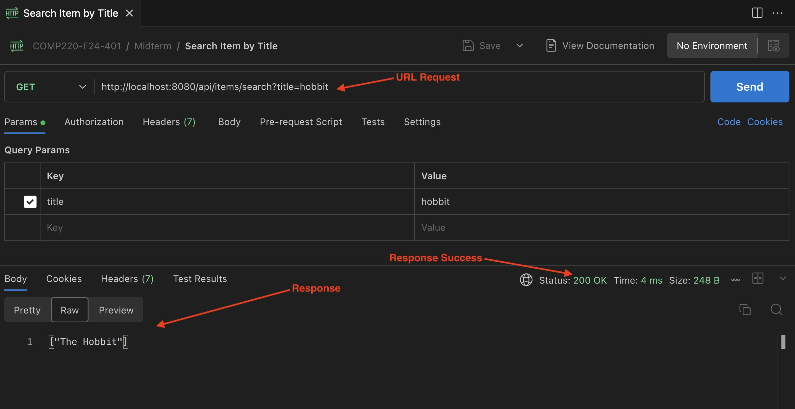

# Midterm API Project - COMP229 Winter 2024

## Project Overview
Your mission, should you choose to accept it, is to implement the missing logic for managing a collection of books via an API. The server is already set up and running on port `8080`, with an array of books ready for you to manipulate.

### Endpoints:
1. **GET /api/items** - Retrieve the full list of books.
2. **GET /api/items/:id** - Retrieve a book by its index (ID).
3. **POST /api/items** - Add a new book to the collection.
4. **PUT /api/items/:id** - Update a book by its index (ID).
5. **DELETE /api/items/:id** - Remove a book from the collection by its index (ID).

The array of books is already defined for you in the `server.js` file, but **you need to implement the logic** for each API endpoint.

### Array Example:

Below is an example of the array you'll be working with:


---

## Setup Instructions

1. **Clone the repository from GitHub**  
   Link to repository: `https://github.com/CENT-COL/COMP229-F24-MIDTERM`

2. **Install dependencies**  
   Run the following command in the root folder to install necessary Node.js packages:
   ```bash
   npm install
   ```

3. **Run the server**  
   Start the server by running:
   ```bash
   node server
   ```

   The server will be running on port `8080`.

4. **Test the API**  
   Use API testing tools like Postman, Thunder Client, or similar to test your API implementation. You should:
   - Make a request to each API endpoint.
   - Provide the necessary request body where applicable (for POST and PUT).
   - Capture the successful response in a screenshot.

---

## Submission Requirements

1. **Screenshots**  
   Provide **clear screenshots** of your API tests, showing the following:
   - The API request.
   - The request body (where applicable).
   - The successful response.
   
   You can use Postman, Thunder Client, or another similar API testing tool.
   ### Postman Test Example:

    Here's an example of what your Postman test should look like when successfully testing your API:

    

2. **Code Submission**  
   - Include your code in a **.zip** file.
   - Provide a **GitHub link** to your repository containing the project.
   - Make sure all screenshots are clearly visible and organized in your submission.

---

## Good luck!
Remember, write clean code, validate your inputs, and handle errors gracefully. May your code be bug-free!


